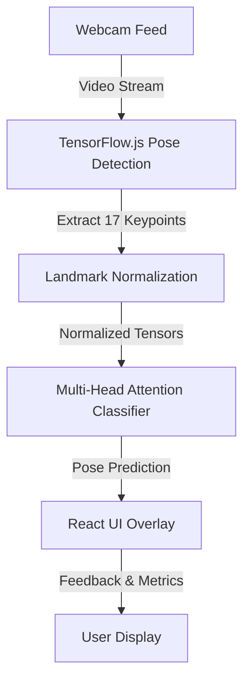
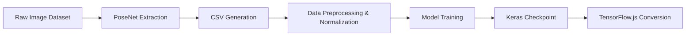

# Yoga Pose Classification and Tracking System

## Project Overview

The Yoga Pose Classification and Tracking System is an advanced, real-time computer vision application designed to detect, track, and classify yoga poses using a standard webcam. By leveraging state-of-the-art machine learning models and web technologies, this system provides users with immediate visual feedback on their posture and alignment during practice.

This repository contains both the frontend React application for user interaction and the backend machine learning pipeline used to train the classification models. The most recent version of the classification model uses a Multi-Head Attention architecture to capture complex dependencies between joint landmarks.

## Architecture Diagram

The system follows a client-side inference architecture, ensuring user privacy by processing video feeds directly in the browser without sending image data to an external server.



## Data Pipeline and Training

The model was trained on a comprehensive dataset of yoga poses, capturing 17 distinct anatomical keypoints.



## Key Features

* **Real-time Pose Detection:** Utilizes `@tensorflow-models/pose-detection` to track 17 body keypoints in real time.
* **Advanced Classification Model:** Features a custom-trained Transformer-style (Multi-Head Attention) neural network for highly accurate pose classification.
* **Privacy-First Design:** All video processing and inference happen locally in the browser via WebGL acceleration.
* **Visual Feedback:** Renders an overlaid skeleton and provides joint angle calculations directly on the video feed.

## Technology Stack

### Frontend Application
* **Framework:** React.js
* **Routing:** React Router DOM
* **Media Handling:** React Webcam
* **Testing:** Jest & Testing Library

### Machine Learning & Vision
* **Core Framework:** TensorFlow.js (`@tensorflow/tfjs`)
* **Detection Model:** MoveNet / PoseNet (`@tensorflow-models/pose-detection`)
* **Training Pipeline:** TensorFlow/Keras (Python), Pandas, Scikit-learn

## Project Structure

```text
yoga-pose-tracking/
├── classification model/
│   ├── data.py                 # Data structure definitions
│   ├── proprocessing.py        # Pipeline for converting images to coordinate CSVs
│   ├── training.py             # Advanced attention-based model training script
│   ├── train_data.csv          # Pre-extracted training landmarks
│   ├── test_data.csv           # Pre-extracted validation landmarks
│   └── model/                  # Exported TFJS model artifacts (.json, .bin)
├── frontend/
│   ├── src/                    # React components, pages, and utilities
│   ├── public/                 # Static assets and hosted ML models
│   ├── package.json            # Node.js dependencies
│   └── README.md               # Frontend-specific documentation
└── README.md                   # Project root documentation
```

## Setup and Installation

### Prerequisites
* Node.js (v14 or higher recommended)
* Python (v3.8 or higher) for retraining the model
* Modern web browser with WebGL support

### Running the Web Application

1. Navigate to the frontend directory:
   `cd frontend`

2. Install dependencies:
   `npm install`

3. Start the development server:
   `export NODE_OPTIONS=--openssl-legacy-provider`
   `npm run start`

4. Open your browser and navigate to `http://localhost:3000`.

### Retraining the Classification Model

To retrain the neural network with new data or hyperparameter tuning:

1. Navigate to the classification model directory:
   `cd "classification model"`

2. Install the required Python packages:
   `pip install tensorflow tensorflowjs pandas scikit-learn`

3. Execute the training script:
   `python training.py`
   *This process will automatically convert the best performing Keras model into TensorFlow.js format and save it in the `model/` subdirectory.*

4. To use the new model in the application, copy the generated files to the frontend public directory:
   `cp -r model/* ../frontend/public/model/`

## Performance Metrics

| Metric | Measurement |
| :--- | :--- |
| **Training Accuracy** | 97.43% |
| **Validation Accuracy** | 99.56% |
| **Test Loss** | 0.0874 |
| **Test Accuracy** | 97.26% |
| **Inference Time** | < 25ms (Device dependent) |

## References

For visual demonstrations of the system's capabilities, please refer to the following demonstration video:
